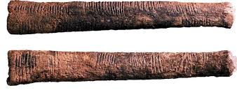
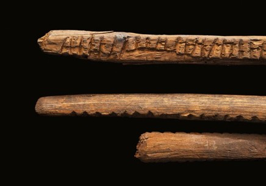

# Contar para contar

En este taller vamos a poner en práctica uno de los procesos centrales de la humanidades digitales: el acto de contabilizar con el propósito de contar una historia. La palabra **contar** tiene una afortunada polisemia en español que vamos a usar como metáfora central del taller ya que nos ayuda a entender una de las potencias de la humanidades digitales. Abstraer fenómenos complejos a escalas perceptibles que nos permiten estudiarlos y trabajarlos como humanistas.

## Contabilizar

El acto de contabilizar para comprender fenómenos del mundo es una invención antigua, hoy le damos mucha importancia y vamos a discutir para que sirve y pare que no. Pero tenemos pistas de que lo hacemos por lo menos desde el paleolítico.

> Huesos tally o Palos de conteo - Paleolítico Superior (40K - 10K AP)

Nos permite bajar el caos a la percepción y por está razón a sido el instrumento principal de las ciencias.

> Mapa Fantasma, epidemia de cólera en Londres, 1854 – John Snow.

Pero también tiene la capacidad de contar historias por medio de su representación.

> Mapa figurativo de las pérdidas humanas sucesivas del ejército francés durante la campaña rusa de 1812-1813, 1869 - Charles Minard

Y en el mejor de los casos, al menos para nosotros lo humanistas, el acto de contar puede ser expresivo y no sólo informativo.

> Coxcomb, 1858 - Florence Nightingale

## Contar a partir del conteo

https://dddrawings.com/notations/

https://enflujo.com/proyectos/

## Taller

Volviendo a la metáfora de contar para contar, vamos a hacer una serie de ejercicios cortos para ir reconociendo las posibilidades. Cada ejercicio nos va conduciendo a formas avanzadas de contar.

### Conteo de palabras

Primero vamos a hacer un conteo de palabras a partir de un texto sencillo. Tomen un texto conozcan bien, puede ser un poema, un fragmento literario, un ensayo o artículo escrito por ustedes. La idea es que lo conozcan muy bien.

**Herramientas**: https://wordart.com/, https://www.wordclouds.com/

### Datos estructurados

### Herramienta de HD

**Herramienta**: https://voyant-tools.org/

### Extracción de datos web (web scrapping)
